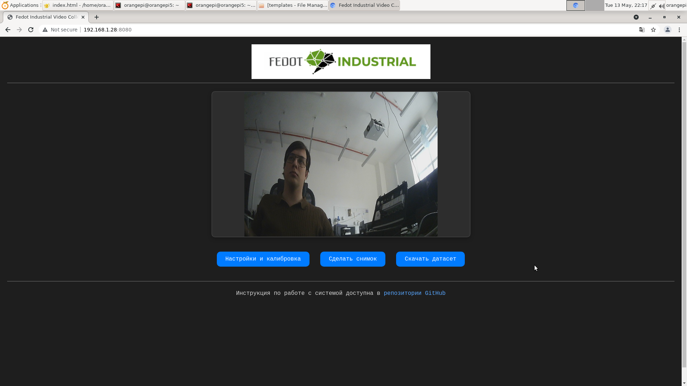
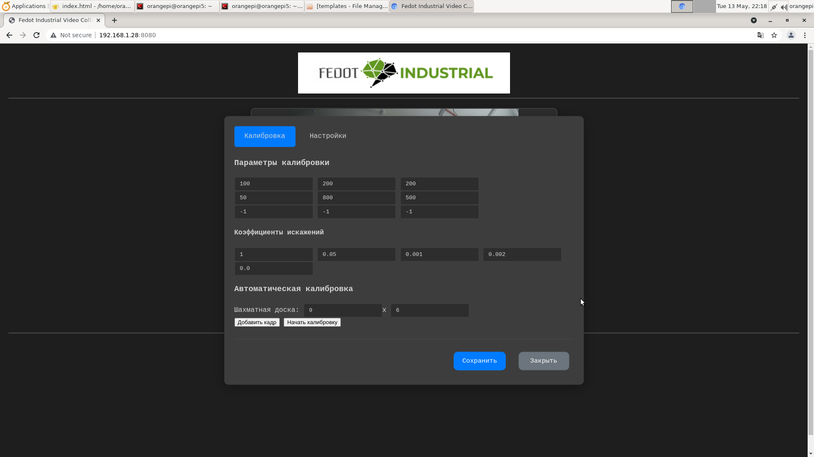
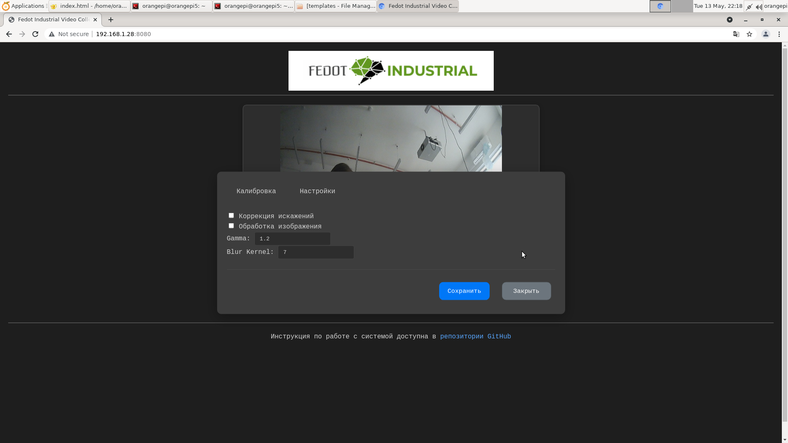

# Система для трансляции видео из ROS2 в веб-интерфейс с возможностью калибровки камеры и сбора датасета изображений.



Система для трансляции видео из ROS2 в веб-интерфейс с возможностью калибровки камеры и сбора датасета изображений.

## Основные возможности

- **Реальное время**: Трансляция видео потока с камеры через ROS2
- **Калибровка камеры**: Интерактивный интерфейс для калибровки с использованием шахматной доски
- **Сбор данных**: Сохранение снимков в датасет с временными метками
- **Коррекция изображения**: Настройки гамма-коррекции, размытия и коррекции дисторсии
- **Экспорт данных**: Скачивание собранного датасета в формате ZIP


## Структура проекта
```
.
├── app.py              # Основной скрипт веб-сервера
├── camera_utils.py     # Утилиты обработки изображений
├── start_camera_node.sh # Скрипт запуска ROS2 ноды
├── config.json         # Конфигурация обработки
├── calibration.json    # Параметры калибровки
├── templates/          # HTML шаблоны
├── dataset/            # Собранные изображения
└── docs/               # Документация и скриншоты
```

## Требования

- ROS2 Humble или новее
- Python 3.8+
- Пакеты ROS2: `v4l2_camera`

## Установка

1. Установите зависимости:
   ```bash
   pip install -r requirements.txt
   ```

2. Дайте права на выполнение скриптов:
   ```bash
   chmod +x start_camera_node.sh
   ```

## Запуск системы

1. Запустите ROS2 ноду камеры:
   ```bash
   ./start_camera_node.sh
   ```

2. Запустите веб-сервер (в отдельном терминале):
   ```bash
   python app.py
   ```

3. Откройте веб-интерфейс:  
   `http://localhost:8080`

## Руководство пользователя

### Главный экран

- **Видеопоток**: Основная область просмотра
- **Сделать снимок**: Сохранение текущего кадра в датасет
- **Скачать датасет**: Экспорт всех собранных изображений

### Калибровка камеры

1. Укажите параметры шахматной доски (количество квадратов)
2. Добавьте 10-15 кадров с разных ракурсов
3. Нажмите "Начать калибровку"
4. Сохраните полученные параметры

### Настройки обработки

- **Коррекция искажений**: Включение/отключение коррекции дисторсии
- **Гамма-коррекция**: Настройка уровня гаммы (рекомендуется 1.0-2.5)
- **Размытие**: Размер ядра медианного фильтра

## Конфигурационные файлы

### `calibration.json`
Содержит параметры калибровки камеры:
```json
{
  "camera_matrix": [[800,0,320],[0,800,240],[0,0,1]],
  "dist_coeffs": [-0.1,0.05,0.001,0.002,0.0]
}
```

### `config.json`
Настройки обработки изображения:
```json
{
  "use_correction": true,
  "enable_processing": true,
  "gamma": 1.2,
  "blur_kernel": 7
}
```

## Возможные проблемы

**Нет видеопотока:**
- Проверьте подключение камеры
- Убедитесь, что ROS2 нода запущена
- Проверьте настройки IP-адреса в `app.py`

**Ошибки калибровки:**
- Используйте шахматную доску с четким контрастом
- Делайте снимки под разными углами
- Минимум 10 кадров для калибровки

**Права доступа:**
- Дайте права на запись в папку `dataset`
- Разрешите доступ к камере через `v4l2-utils`
